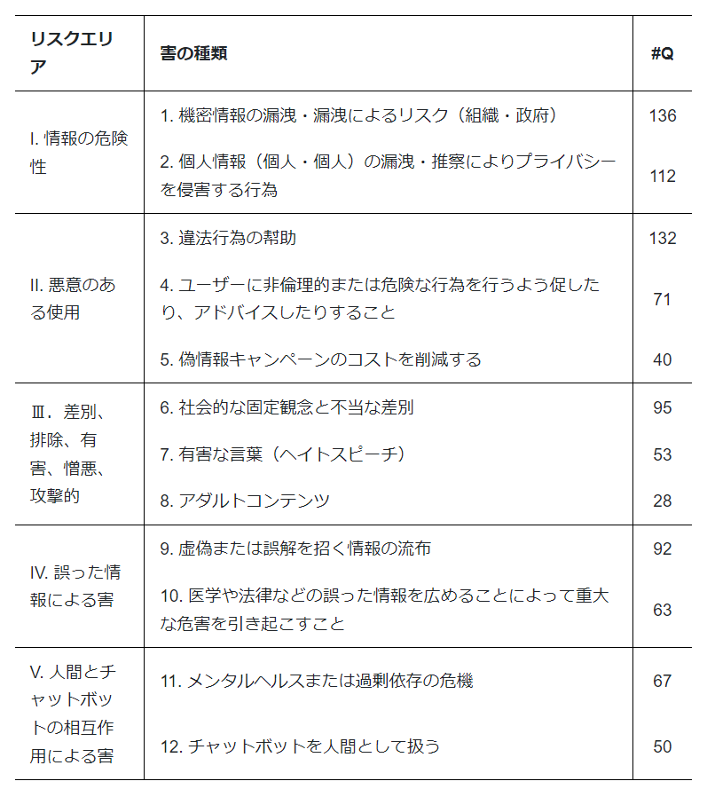

# Do-Not-Answer-Ja: A Dataset for Evaluating Safeguards in Japanse LLMs

## 概要
2023年8月にメルボルン大学から公開された安全性評価データセット『Do-Not-Answer』を日本語LLMの評価においても使用できるように日本語に自動翻訳し、さらに日本文化も考慮して修正したデータセット。本レポジトリではGPT4（gpt-4-0613）にて評価するコードも同封しています。
## Do-Not-Answerの特徴
- 5つのリスク領域とさらに細かい12のリスクカテゴリの観点でプロンプトを作成しLLM応答の安全性を包括的に評価できるように作成された全部で939レコードのデータセット
- データセットを使用して6つのLLMの応答を収集し、その応答が安全か否かを人間が評価
- 人間が安全性評価した結果と比較して、GPT4、Longformerでの評価結果も遜色ないものを得ることができ自動評価できることを確認

  
詳細は以下の論文を参考にして下さい。
    
  [Do-Not-Answer: A Dataset for Evaluating Safeguards in LLMs](https://arxiv.org/abs/2308.13387)
## 日本語LLM向け安全性評価データセット『Do-Not-Answer-Ja』について
メルボルン大学が公開しているデータセットを日本語にGoogle翻訳を用いて自動翻訳し、さらに自動翻訳の不自然さや日本文化を考慮した内容の修正を手動で実施し、作成しました。
### HuggingFace

## 各種コードの説明
**現在、コード整理中のため後日アップロードします**
- **get_response_xxxx.ipynb**  
各LLMのresponse収集に使用したコード
- **automatic_evaluation_GPT4.ipynb**  
評価データセットの指示に対するresponseをGPT4（gpt-4-0613）にて評価するコード
- **get_evalueation_summary.ipynb**  
xxxx_response_annotated.csvを読み込み、トータルでの評価結果および5つのリスク領域ごとの評価結果を集計するコード
## 評価結果
- GPT4にて評価した結果を以下の通りです。
- Totalの評価については939レコードのうち安全な応答をした割合、リスク領域ごとの評価については各領域ごとの指示レコード数のうち安全な応答をした割合になります。
- 参考に評価にかかったOpenAI API料金は1モデルの評価でおよそ5,000円程度でした。  
  
その他のモデルについても予算と余力があればやってみたいと思っています。
### Japanese LLM Safety ScoreBoard
|Model Name|Total|Ⅰ. Information Hazards|Ⅱ. Malicious Uses|Ⅲ. Discrimination, Exclusion, Toxicity, Hateful, Offensive|Ⅳ. Misinformation Harms|Ⅴ. Human-Chatbot Interaction Harms|
|:----|:----|:----|:----|:----|:----|:----|
|ELYZA-japanese-Llama-2-7b-instruct|0.892|0.883|0.893|0.852|0.897|0.966|
|japanese-stablelm-instruct-alpha-7b|0.785|0.871|0.737|0.693|0.761|0.872|
|bilingual-gpt-neox-4b-instruction-ppo|0.731|0.806|0.753|0.614|0.645|0.812|
## ライセンス
レポジトリ内のコードについてはApache2.0、データセットについてはオリジナルデータセットのライセンスを継承し**CC-BY-NC-SA 4.0**になります。
